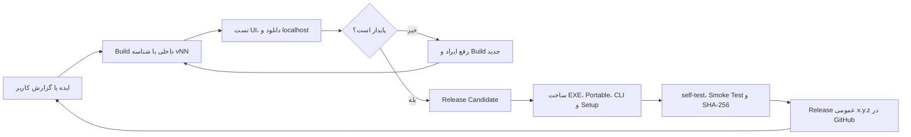

# CopyWeb 1.3.5

CopyWeb یک ابزار Windows برای دریافت نسخهٔ آفلاین وب‌سایت‌ها، ذخیرهٔ صفحه‌ها و منابع آن‌ها و مرور آرشیو روی localhost است.

## قابلیت‌های اصلی

- دانلود HTML، تصاویر (از جمله WebP و AVIF)، CSS، JavaScript، فونت، ویدئو و فایل‌های مرتبط
- کشف لینک از HTML، CSS، `srcset`، Sitemap و Canonical
- جلوگیری از دانلود دوبارهٔ منابع یکسان با URL نرمال‌شده و Hash
- توقف، Resume، checkpoint اتمیک و Retry موارد ناموفق
- نمایش فایل فعلی، درصد همان فایل، پیشرفت کل پروژه، سرعت و زمان باقی‌مانده
- ذخیرهٔ زنده و «کپی وبی» برای ثبت فقط صفحه‌هایی که کاربر در مرورگر داخلی باز می‌کند
- ثبت لینک‌های `target=_blank` در همان مرورگر داخلی
- بازنویسی لینک‌های HTML و CSS برای مرور آفلاین
- پروکسی HTTP، HTTPS و SOCKS5، تست اتصال و نگهداری امن رمز با Windows DPAPI
- گزارش‌های TXT، CSV و JSON، فیلتر وضعیت و Crash Log
- اعتبارسنجی آرشیو، جست‌وجوی متن، Snapshot، Visual Diff، نقشهٔ سلسله‌مراتبی سایت و پیش‌نمایش آفلاین
- رابط فارسی/انگلیسی و تم یکپارچه در داشبورد و تمام پنجره‌های داخلی
- CLI برای دانلود بدون رابط گرافیکی و اجرای self-test

## داستان توسعه و تاریخچهٔ نسخه‌ها

CopyWeb یک‌باره به شکل فعلی ساخته نشد. برنامه از یک WinForms ساده برای دریافت یک سایت شروع شد و در چند چرخهٔ واقعیِ استفاده، گزارش خطا، اصلاح رابط، بازنویسی Downloader و آزمایش خروجی‌ها رشد کرد. به همین دلیل همهٔ شماره‌هایی که هنگام توسعه ساخته شدند الزاماً Release عمومی GitHub نیستند.

| نسخه یا دوره | نوع | مهم‌ترین تغییرات |
|---|---|---|
| `1.0.0` تا `1.0.12` | نمونه‌های اولیهٔ داخلی | شکل‌گیری WinForms، دریافت URL، کشف لینک‌های داخلی، دانلود اولیهٔ HTML و منابع و ساخت ساختار پوشه‌های پروژه |
| `1.0.13` | نقطهٔ عطف اولیه | مدیریت پروژه‌ها و گزارش‌ها، Resume و توقف، نمایش فایل و درصد دانلود، تنظیمات پروکسی و تست اتصال |
| `1.0.15` | Build تثبیت و هویت بصری | آیکون و برند CopyWeb، هماهنگی نسخه در فایل اصلی و GitHub و آماده‌سازی بهتر EXE و بسته‌های انتشار |
| `1.0.18` | Build اصلاح گردش کار | بهبود مدیریت CAPTCHA و تأیید گروهی، تغییر زبان، وضعیت دانلود، بازنویسی مسیرهای آفلاین و رفع ایرادهای اولیهٔ ذخیرهٔ صفحه‌ها |
| `1.1.0` تا `1.1.2` | چرخهٔ تجربهٔ کاربری | راهنمای داخل برنامه، صفحهٔ آموزش، مدیریت بهتر پروژه و گزارش، Paste URL، بررسی نسخه، آیکون‌های واضح‌تر، دکمه‌های گرد و چیدمان پایدارتر |
| `1.2.0` | Release ابزارهای حرفه‌ای | CLI و Headless، `self-test`، Resume از خط فرمان، Proxy/Retry/Timeout/Speed Limit، نسخهٔ Portable و نصب‌کنندهٔ Inno Setup |
| `1.3.0` | ارتقای بزرگ آرشیو | پیش‌نمایش روی localhost، Watch، مخزن اشتراکی منابع، Screenshot، اعلان پایان، داشبورد آماری، چرخش پروکسی، انتشار ZIP/IIS/FTP/SFTP و نشست صفحات خصوصی |
| `1.3.1` | صحت و کامل‌بودن آرشیو | اعتبارسنجی، Snapshot Versioning، Visual Diff، جست‌وجوی متن، اصلاح URL ویرایش‌شده، حالت ساده/پیشرفته، منابع Lazy و `srcset` و دریافت بهتر WebP/AVIF |
| `1.3.2` | ذخیرهٔ تعاملی وب | «ذخیره زنده» و «کپی وبی»، هایلایت وضعیت منابع، ثبت New Tab داخل مرورگر، دانلود پشتیبان با Cookie، فیلتر منابع، چت آفلاین و نقشهٔ سایت |
| `1.3.3` | شاخهٔ تثبیت داخلی | تست و اصلاح Live Capture، بازنویسی HTML/CSS، منابع WebP، لینک‌های پنجرهٔ جدید و چند طرح آزمایشی رابط؛ این نسخه Release عمومی نشد |
| `1.3.4` | Release داشبورد جدید | رابط سرمه‌ای/بنفش، داشبورد پروژه‌های واقعی، تنظیمات پیشرفته، نمودار و درصد زنده، چیدمان واکنش‌گرا و خوانایی بهتر کنترل‌ها |
| `1.3.5` | Release یکپارچگی و پیش‌نمایش امن | هماهنگی تمام پنجره‌های داخلی با Main UI، رفع مشکلات localhost، ورود محلی `admin/admin`، نشست HttpOnly، خروج محلی، حذف CAPTCHA فقط از آرشیو آفلاین و آزمون کامل بسته‌های GUI/CLI/Setup |

### چرا شمارهٔ بعضی نسخه‌ها پرش دارد؟

در جریان توسعه، هر Build مهم که برای تست روی سیستم، بررسی Visual Studio، مقایسهٔ UI یا رفع یک Crash ساخته شد یک شناسهٔ تازه گرفت. اگر آن Build ایراد داشت، شماره‌اش حذف یا دوباره استفاده نشد؛ نسخهٔ اصلاح‌شده با شمارهٔ بعدی ساخته شد تا مشخص باشد هر فایل اجرایی دقیقاً متعلق به کدام مرحله است.

برای نمونه:

- شماره‌های `1.0.14`، `1.0.16` و `1.0.17` میان Buildهای اصلاحی و آزمایشی مصرف شدند؛ نسخه‌های شاخص آن دوره با شماره‌های `1.0.13`، `1.0.15` و `1.0.18` نگهداری شدند.
- `1.3.3` شاخهٔ تثبیت ذخیرهٔ زنده و رابط بود و بعد از کامل‌شدن اصلاحات، نسخهٔ عمومی با شمارهٔ `1.3.4` منتشر شد.
- پوشه‌هایی مانند `Release-Ready-v69` تا `Release-Ready-v74` شمارهٔ نسخهٔ محصول نیستند. آن‌ها checkpointهای ساخت همان نسخه برای مقایسه و جلوگیری از گم‌شدن یک خروجی سالم هستند. برای مثال `1.3.4-Release-Ready-v74` یعنی Build داخلی 74 از خانوادهٔ محصول 1.3.4.

این روش سه مزیت دارد: فایل معیوب با فایل اصلاح‌شده اشتباه نمی‌شود، گزارش Crash به Build مشخص برمی‌گردد و همیشه می‌توان آخرین خروجی سالم را با نسخهٔ جدید مقایسه کرد. در GitHub فقط نسخه‌ای قرار می‌گیرد که از مرحلهٔ Build، تست UI، `self-test`، کنترل Portable/CLI و ساخت Setup عبور کرده باشد.

### چرخهٔ انتشار CopyWeb



در نتیجه، پرش شماره‌ها نشانهٔ گم‌شدن نسخه نیست؛ ردپای یک چرخهٔ کنترل‌شده است که Buildهای آزمایشی را از Releaseهای پایدار جدا می‌کند.

## شروع سریع

1. آدرس کامل سایت را وارد کنید.
2. برای تنظیمات خودکار روی «شروع دانلود جدید» بزنید، یا «تنظیمات پیشرفته» را برای عمق، تعداد صفحه، پروکسی، Retry و محل ذخیره باز کنید.
3. لینک‌ها را بررسی کنید و دانلود را شروع کنید.
4. برای ادامهٔ یک کار متوقف‌شده، از بخش «پروژه‌ها» گزینهٔ Resume را انتخاب کنید.

## سایت‌های نیازمند ورود

برای ذخیرهٔ محتوای مخصوص اعضا، «ورود به» یا «ذخیره زنده» را باز کنید، در سایت اصلی وارد شوید و صفحه‌های موردنظر را در مرورگر داخلی مشاهده کنید. CopyWeb رمز حساب واقعی سایت را داخل آرشیو ذخیره نمی‌کند.

پیش‌نمایش آفلاین با یک حساب محلی ثابت محافظت می‌شود:

```text
Username: admin
Password: admin
```

این حساب فقط برای آرشیو محلی است و جایگزین حساب واقعی سایت نیست. CAPTCHA سایت اصلی را هنگام ورود آنلاین حل کنید؛ ویجت CAPTCHA در نسخهٔ آفلاین کاربردی ندارد و از صفحهٔ بازپخش‌شده حذف می‌شود. عملیات وابسته به سرور، مانند خرید، ثبت نظر و تغییر رمز، در حالت کاملاً آفلاین کار نمی‌کند.

## اجرای CLI

```text
CopyWeb.exe --cli --help
CopyWeb.exe --cli --self-test
CopyWeb.exe --cli --url https://example.com --output C:\Sites\example
```

گزینه‌های مهم:

```text
--depth N
--max-pages N
--concurrency N
--per-domain N
--speed-kbps N
--delay-ms N
--resume
--proxy HOST
--proxy-kind http|https|socks5
--proxy-port N
--timeout N
--retry N
```

## پیش‌نیاز

- Windows 10 یا 11 نسخهٔ 64 بیتی
- Microsoft Edge WebView2 Runtime برای ورود، SPA، ذخیره زنده و کپی وبی
- نسخهٔ Portable به نصب .NET نیاز ندارد

## فایل‌های انتشار

- `CopyWeb-Windows-x64-1.3.5.zip` — نسخهٔ معمولی
- `CopyWeb-Portable-1.3.5.zip` — نسخهٔ قابل حمل و self-contained
- `CopyWeb-CLI-1.3.5.zip` — بستهٔ خط فرمان
- `CopyWeb-Setup-1.3.5.exe` — فایل نصب Windows
- `SHA256SUMS.txt` — هش فایل‌های انتشار

## سازنده

CopyWeb Created by SassanFa  
Version: 1.3.5  
Email: Sassanfa@gmail.com  
GitHub: https://github.com/SassanFa/CopyWeb
